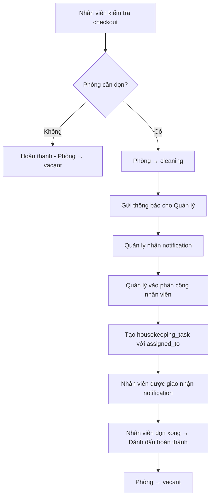

## Kế hoạch: Gộp kiểm tra checkout + Thêm chức năng báo dọn phòng

### I. THAY ĐỔI LOẠI KIỂM TRA

#### Từ 4 loại → Giữ nguyên 4 loại nhưng đổi mục đích

| Check Type | Tên cũ | Tên mới | Mục đích |
|------------|--------|---------|----------|
| `daily` | Kiểm tra hàng ngày | **Giữ nguyên** | Kiểm tra phòng có khách |
| `checkout` | Kiểm tra SAU checkout | **Kiểm tra checkout** | Kiểm tra TRƯỚC khi khách trả phòng + Báo dọn |
| `checkin` | Kiểm tra trước check-in | **Giữ nguyên** | Đảm bảo phòng sẵn sàng |
| `maintenance` | Kiểm tra bảo trì | **Giữ nguyên** | Sau sửa chữa |

---

### II. CẤU TRÚC FORM KIỂM TRA CHECKOUT MỚI

#### Các bước trong form:

```
Step 1: Chọn loại kiểm tra (checkout)
Step 2: Kiểm tra đồ đạc (lost/damaged/consumed)
Step 3: Đồ tính phí minibar (chargeable items)
Step 4: Tình trạng phòng + Yêu cầu dọn dẹp (MỚI)
Step 5: Tổng kết & Gửi
```

#### Step 4 mới - CleaningRequestStep:

```typescript
interface CleaningRequestData {
  needs_cleaning: boolean           // Phòng có cần dọn không?
  cleaning_priority: 'low' | 'medium' | 'high' | 'urgent'
  cleaning_notes?: string           // Ghi chú cho bộ phận dọn dẹp
  room_condition: 'clean' | 'dirty' | 'very_dirty'
}
```

**UI Design:**
```
┌─────────────────────────────────────────┐
│ Tình trạng phòng                        │
├─────────────────────────────────────────┤
│ Phòng hiện tại:                         │
│ ○ Sạch (Không cần dọn)                  │
│ ○ Bẩn nhẹ (Cần dọn thường)              │
│ ○ Rất bẩn (Cần dọn gấp)                 │
│                                         │
│ ┌─────────────────────────────────────┐ │
│ │ ☐ Yêu cầu dọn dẹp ngay              │ │
│ └─────────────────────────────────────┘ │
│                                         │
│ Mức độ ưu tiên:                         │
│ [Dropdown: Thấp / Trung bình / Cao]     │
│                                         │
│ Ghi chú cho bộ phận dọn dẹp:            │
│ ┌─────────────────────────────────────┐ │
│ │ (Textarea)                          │ │
│ └─────────────────────────────────────┘ │
└─────────────────────────────────────────┘
```

---

### III. WORKFLOW SAU KHI SUBMIT



---

### IV. FILES CẦN THAY ĐỔI/TẠO MỚI

| File | Thay đổi |
|------|----------|
| `src/lib/roomCheckConfig.ts` | Cập nhật label/description cho checkout |
| `src/types/rooms.types.ts` | Thêm `CleaningRequestData` interface |
| `src/components/rooms/check-steps/CleaningRequestStep.tsx` | **TẠO MỚI** - Form báo dọn phòng |
| `src/pages/rooms/RoomCheckPage.tsx` | Thêm Step 4 cho checkout, xử lý logic gửi thông báo |
| `src/hooks/useRoomChecks.ts` | Cập nhật `processCheckoutCheck` để tạo task + notify |

---

### V. LOGIC XỬ LÝ TRONG useRoomChecks.ts

```typescript
async function processCheckoutCheck(params) {
  // ... existing logic (lost/consumed/damaged items)
  
  // NEW: Xử lý yêu cầu dọn phòng
  if (data.needs_cleaning) {
    // 1. Đổi trạng thái phòng → cleaning
    await supabase
      .from('rooms')
      .update({ status: 'cleaning' })
      .eq('id', roomId)
    
    // 2. Gửi thông báo cho Manager (KHÔNG tự động tạo task)
    const managers = await getNotificationRecipients({
      tenantId,
      hotelId,
      roles: ['owner', 'hotel_manager'],
      excludeUserId: userId,
    })
    
    await createMultipleNotifications({
      recipientIds: managers.map(m => m.id),
      type: 'room_cleaning_request',
      title: `Yêu cầu dọn phòng ${roomNumber}`,
      message: `${userName} đã báo phòng ${roomNumber} cần dọn dẹp. Mức độ: ${priorityLabel}`,
      referenceType: 'room',
      referenceId: roomId,
      actionUrl: `/rooms/${roomId}?action=assign-cleaning`,
    })
    
    // 3. Gửi push notification + Telegram
    await sendMultiplePushNotifications(...)
    await sendTelegramNotification(...)
    
  } else {
    // Phòng sạch → Chuyển thẳng sang vacant
    await supabase
      .from('rooms')
      .update({ status: 'vacant' })
      .eq('id', roomId)
  }
}
```

---

### VI. QUẢN LÝ PHÂN CÔNG NHÂN VIÊN

#### Khi Manager nhận thông báo:

1. Click vào notification → Vào trang chi tiết phòng
2. Thấy banner "Phòng cần dọn dẹp" + thông tin ghi chú
3. Click "Phân công nhân viên"
4. Chọn nhân viên từ danh sách → Tạo `housekeeping_task`
5. Nhân viên được giao nhận notification

**UI trong RoomDetailPage:**

```
┌─────────────────────────────────────────────┐
│ 🧹 Phòng cần dọn dẹp                        │
│                                             │
│ Báo bởi: Nguyễn Văn A (10:30)               │
│ Mức độ: Cao                                 │
│ Ghi chú: Khách để lại nhiều rác             │
│                                             │
│ [Phân công nhân viên]  [Tự dọn]             │
└─────────────────────────────────────────────┘
```

---

### VII. KẾT QUẢ SAU TRIỂN KHAI

1. Nhân viên kiểm tra checkout 1 lần duy nhất, bao gồm cả kiểm kê và đánh giá tình trạng phòng
2. Nếu phòng cần dọn → Thông báo real-time đến Manager
3. Manager chủ động phân công (không tự động) → Kiểm soát tốt hơn
4. Nhân viên được giao việc rõ ràng, có thông tin chi tiết từ người kiểm tra
5. Workflow đơn giản, ít bước hơn

---

### VIII. THỨ TỰ TRIỂN KHAI

1. **Phase 1**: Tạo `CleaningRequestStep.tsx` component
2. **Phase 2**: Cập nhật `RoomCheckPage.tsx` - thêm step 4
3. **Phase 3**: Cập nhật `useRoomChecks.ts` - logic gửi notification
4. **Phase 4**: Thêm UI "Phân công dọn phòng" trong `RoomDetailPage.tsx`
5. **Phase 5**: Test toàn bộ flow từ checkout → notify → assign → complete

