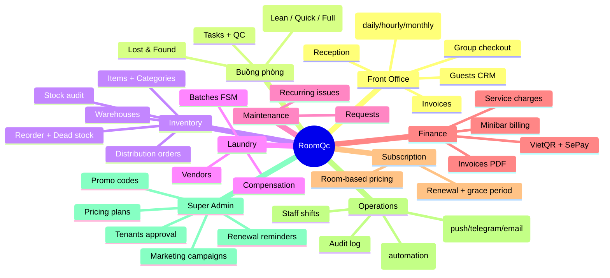

# L1 — System Context

## Sản phẩm

**RoomQc** (codename: Hotel Asset Manager) — SaaS quản lý vận hành cho khách sạn 2-4★ và chuỗi nhỏ tại Việt Nam.

Trọng tâm: **Buồng phòng (housekeeping/QC)** → mở rộng sang Bookings, Payment, Inventory, Laundry, Operations, Chain/HQ.

## Actors

```mermaid
flowchart LR
  subgraph Tenant["Tenant (1 doanh nghiệp = 1..N hotels)"]
    Owner[Owner / Chủ KS]
    Mgr[Hotel Manager / Department Manager]
    Staff[Staff (Reception / Housekeeping / Laundry / Maintenance)]
    Guest[Khách lưu trú]
  end
  SA[Super Admin (RoomQc)]
  OTA[OTA: Booking.com / Agoda / Traveloka / Expedia]
  Bank[Ngân hàng (VietQR)]

  Owner & Mgr & Staff -->|Web + PWA mobile| App
  Guest -->|QR thanh toán / scan CCCD| App
  SA -->|Super Admin Console| App
  App[(RoomQc Web App)]
  App -->|webhook callback| SePay
  Bank -->|chuyển khoản| SePay[SePay] -->|webhook| App
  App <-->|booking import| OTA
```

## Tích hợp ngoài

| Hệ thống | Vai trò | Hướng |
|---|---|---|
| **Lovable Cloud (Supabase)** | DB, Auth, Storage, Edge Functions, Realtime | host |
| **SePay** | Match webhook chuyển khoản → confirm payment | inbound webhook `/sepay-webhook` |
| **VietQR** | Sinh QR code chuyển khoản theo invoice | client-side render |
| **Lovable AI Gateway** | OCR CCCD/Hộ chiếu (Gemini Flash), document validation | server-to-server |
| **Telegram Bot API** | Push notification cho staff/manager | edge fn `send-telegram-notification` |
| **Web Push (VAPID)** | PWA push notification | edge fn `send-push-notification` |
| **Resend / SMTP** | Email transactional, OTP, hóa đơn PDF | edge fn `send-*-email` |
| **OTA APIs** (roadmap) | Sync availability, import booking | chưa hoàn thiện |

## Mô hình triển khai

```mermaid
flowchart TB
  subgraph Client["Client tier"]
    Browser[Browser / PWA]
    Mobile[Mobile capture page (anonymous)]
  end
  subgraph Edge["Lovable Cloud Edge"]
    EF[28 Edge Functions]
    Cron[pg_cron + edge cron]
  end
  subgraph Data["Postgres (Supabase)"]
    Tables[(92 tables, RLS enforced)]
    RPC[(139 RPC functions)]
    Trig[~150 triggers]
    RT[Realtime publication]
  end
  Browser -->|JWT, RLS| Tables
  Browser -->|rpc| RPC
  Browser -->|subscribe| RT
  Browser -->|invoke| EF
  Mobile -->|anonymous| EF
  EF --> Tables
  EF --> RPC
  Cron --> EF
  Cron --> RPC
  Trig --> Tables
```

## Modes của Tenant

(Xem `01-modules/users-permissions.md` cho chi tiết)

- **Homestay** — 1 hotel, ít user, tắt chain features.
- **Hotel** — 1 hotel, đầy đủ tính năng vận hành.
- **Chain** — N hotels, có HQ view, All Hotels mode.

## Phạm vi nghiệp vụ chính


