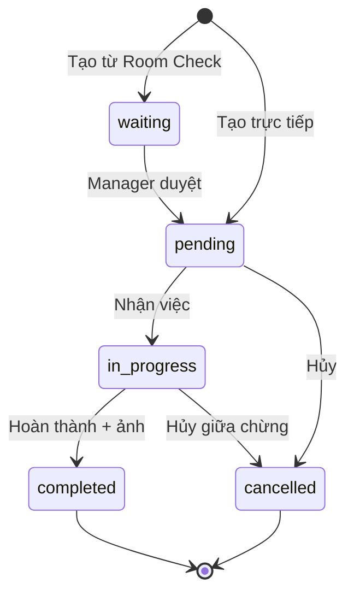

# Module: Maintenance

## Phạm vi
Quản lý yêu cầu bảo trì, sửa chữa, thay thế thiết bị trong khách sạn. Tích hợp với Room Check Lean (issue type → maintenance request) và Notifications.

## Routes
| Path | Component | Guard |
|---|---|---|
| `/maintenance` | `MaintenanceDashboardPage` | `view_maintenance` |
| `/maintenance/requests` | `MaintenanceRequestList` | `view_maintenance` |
| `/maintenance/requests/new` | Form tạo mới | `manage_maintenance` |
| `/maintenance/requests/:id` | Chi tiết | `view_maintenance` |
| `/maintenance/requests/edit/:id` | Form sửa | `manage_maintenance` |
| `/maintenance/recurring-issues` | `RecurringIssuesPage` | `view_maintenance` |

## State machine

## Bảng chính
- `maintenance_requests` — yêu cầu bảo trì
  - `status`: `waiting | pending | in_progress | completed | cancelled`
  - `priority`: `low | medium | high | urgent`
  - `issue_type`: `repair | replace | inspection | cleaning | other`
  - `room_id`, `category_id`, `reported_by`, `assigned_to`, `resolved_at`, `cost`
- `maintenance_categories` — danh mục bảo trì (per tenant)

## Recurring detection
Query gom theo `(room_id, category_id)` trong 30 ngày → flag nếu ≥ 3 request.
Hiển thị ở `/maintenance/recurring-issues` để gợi ý replace thay vì repair.

## Tích hợp
- **Room Check Lean**: issue bucket `damaged_lost` + `chargeable_consumed` → tạo `maintenance_requests` với `status='waiting'`.
- **Notifications**: assign job → push + telegram cho `assigned_to`.
- **Inventory**: nếu `issue_type='replace'` → tạo distribution order draft.

## Permissions
- `view_maintenance`: staff trở lên
- `manage_maintenance`: manager trở lên (assign, hủy)
- `approve_maintenance`: manager (waiting → pending)

## Refactor cần thiết
- F-FSM-01 (transition phải qua RPC) — hiện update trực tiếp.
- Thiếu audit log cho assign/cancel.
