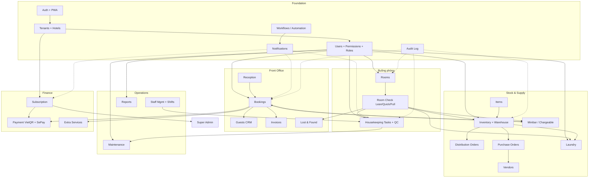

# Module Map (L2)

16 module nghiệp vụ + module hạ tầng. Mỗi node có file riêng trong `01-modules/`.

## Dependency graph

## Bảng module × file chi tiết

| Module | File | RPC chính | Bảng chính | Edge fn |
|---|---|---|---|---|
| Auth + PWA | (07-frontend/pwa-offline.md) | `verify_otp`, `reset_password_with_otp` | `users`, `user_preferences` | `reset-password-with-otp`, `verify-otp` |
| Bookings | [bookings.md](./bookings.md) | `perform_checkin`, `perform_checkout`, `transition_booking_status`, `cancel_booking` | `room_bookings`, `booking_payments`, `pending_group_links` | `expire-pending-payments` |
| Rooms | [rooms.md](./rooms.md) | `transition_room_status` | `rooms`, `room_types`, `room_type_standards`, `room_pricing_rules` | `lift-expired-dnd-oos` |
| Housekeeping | [housekeeping.md](./housekeeping.md) | `submit_room_check_lean`, `perform_quick_room_check`, `undo_quick_room_check`, `reopen_room_check`, `transition_task_status`, `approve_task` | `room_checks`, `room_check_sessions`, `room_check_issues`, `housekeeping_tasks` | `process-room-check-outbox`, `reconcile-room-check-side-effects` |
| Laundry | [laundry.md](./laundry.md) | `add_laundry_to_draft_batch`, `atomic_item_to_laundry` | `laundry_batches`, `laundry_batch_items`, `laundry_vendors`, `compensation_requests` | `laundry-compensation-cron` |
| Inventory | [inventory.md](./inventory.md) | `atomic_item_consumed`, `atomic_item_lost`, `apply_asset_group_mapping`, `approve_reorder_suggestions`, `batch_confirm_room_deliveries` | `items`, `warehouses`, `warehouse_stock`, `inventory_transactions`, `distribution_orders`, `stock_adjustments`, `consumption_snapshots`, `reorder_suggestions` | `dead-stock-digest`, `notify-chargeable` |
| Maintenance | [maintenance.md](./maintenance.md) | – (CRUD) | `maintenance_requests`, `maintenance_categories` | – |
| Payment | [payment.md](./payment.md) | – | `payment_transactions`, `bank_payment_settings`, `invoices` | `sepay-webhook`, `sync-sepay-transactions` |
| Subscription | [subscription.md](./subscription.md) | `apply_promo_code`, `approve_tenant`, `calculate_tenant_storage` | `tenants`, `subscription_plans`, `plan_price_history`, `renewal_reminders`, `promotional_codes`, `promo_code_usage` | `check-subscription-status` |
| Users + Perm | [users-permissions.md](./users-permissions.md) | `has_user_permission`, `calculate_staff_statistics` | `users`, `user_roles`, `roles`, `permissions`, `role_permissions`, `positions`, `user_hotels` | `create-user`, `update-user` |
| Guests CRM | [guests-crm.md](./guests-crm.md) | – (trigger) | `guests` | – |
| Reports | [reports.md](./reports.md) | (xem reports.md) | `staff_statistics`, `tenant_usage` | – |
| Notifications | [notifications.md](./notifications.md) | – | `notifications`, `in_app_notifications`, `email_notifications`, `push_subscriptions`, `notification_preferences`, `telegram_connections`, `telegram_groups` | `send-notification-email`, `send-push-notification`, `send-telegram-notification`, `send-welcome-email`, `send-invoice-email` |
| Workflows | [workflows.md](./workflows.md) | – | `workflows`, `workflow_actions`, `workflow_executions` | `execute-workflow` |
| Super Admin | [super-admin.md](./super-admin.md) | `approve_tenant` | `super_admin_activity_log`, `platform_settings`, `marketing_campaigns`, `campaign_engagement` | `check-shift-overtime`, `cleanup-sessions` |
| Lost & Found | [lost-found.md](./lost-found.md) | – | `lost_found_items` | – |
| Scan / OCR | (03-flows/auth-flow.md) | – | `document_scan_sessions` | `scan-guest-document`, `mobile-scan-upload`, `get-scan-session`, `beeknoee-models` |

## Quy tắc liên module

- **Tasks gắn vào Booking/Room** đi qua `housekeeping_tasks` (1 hub duy nhất, không tạo bảng riêng cho từng nguồn).
- **Mọi mutation đa bảng** đi qua RPC atomic. Không update từng bảng riêng lẻ ở client.
- **Notifications** chỉ subscribe sự kiện qua `notifications` table + realtime, không gọi trực tiếp giữa module.
- **Workflows** là lớp "trigger × action" để liên kết chéo module mà không hardcode dependency.

Xem từng file module để biết chi tiết RPC, schema, flow.
