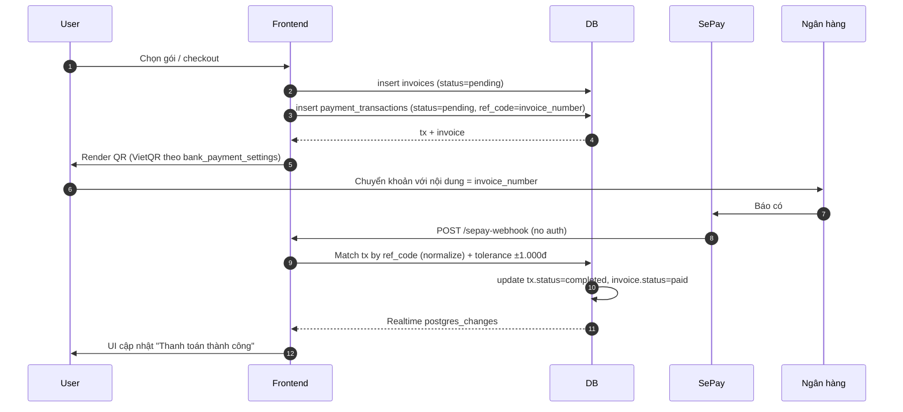

# Module: Payment (VietQR + SePay)

**Phụ thuộc**: Bookings · Subscription · Invoices · Notifications.

## Hai chiều dùng

1. **Khách trả phòng** → tạo `payment_transaction` cho `room_bookings`.
2. **Tenant gia hạn / mua thêm phòng** → tạo `payment_transaction` cho `subscription_plans`.

Cùng schema, khác `metadata.type`:

| `metadata.type` | Ý nghĩa |
|---|---|
| `extend` | Gia hạn subscription (KHÔNG dùng `renewal`) |
| `additional_rooms` | Mua thêm phòng |
| `booking_payment` | Khách trả phòng |
| `deposit` | Đặt cọc |

## Flow VietQR



### Chi tiết match

- `normalizeString()` loại ký tự đặc biệt + lowercase.
- Tolerance `±payment_tolerance_vnd` (mặc định 1.000đ, configurable).
- Nếu không match → `pending_group_links` chờ thủ công.

## Bank settings hierarchy

- **Hotel-level**: `bank_payment_settings` per hotel cho khách.
- **Global / Super Admin**: cho subscription.
- Memory: `architecture/payment/vietqr-settings-hierarchy`.

## Realtime invalidation sau payment

```text
['tenant-subscription', 'pending-payments', 'pending-payments-count',
 'payment-transactions', 'invoices']
```

## Edge functions

```text
sepay-webhook            # public, no auth, match + update
sync-sepay-transactions  # backfill manual (manager trigger)
expire-pending-payments  # cron hủy QR quá hạn
```

## QR Public Access

- `/payment-qr/:paymentId` route public — khách scan QR có thể vào không cần login.
- Memory: `qr-payment-public-access-spec`.

## Group payment distribution

- Memory: `group-payment-distribution-fix-v1`.
- Khi pay tổng cho nhóm → distribute theo `roomCostsByBooking` (proportional).
- Sau pay xong **KHÔNG auto checkout** — staff phải bấm checkout thủ công (Group Checkout Enforcement).

## Rủi ro

- F-PAY-01: Webhook không có auth → cần rate limit + IP allowlist của SePay.
- F-PAY-02: Match dựa trên ref_code text → vẫn có khả năng false match. Nên thêm secondary match theo amount + thời gian.
- F-PAY-03: Reference codes có nhiều convention (memory `qr-payment-system-spec`). Cần 1 hàm sinh canonical duy nhất.
