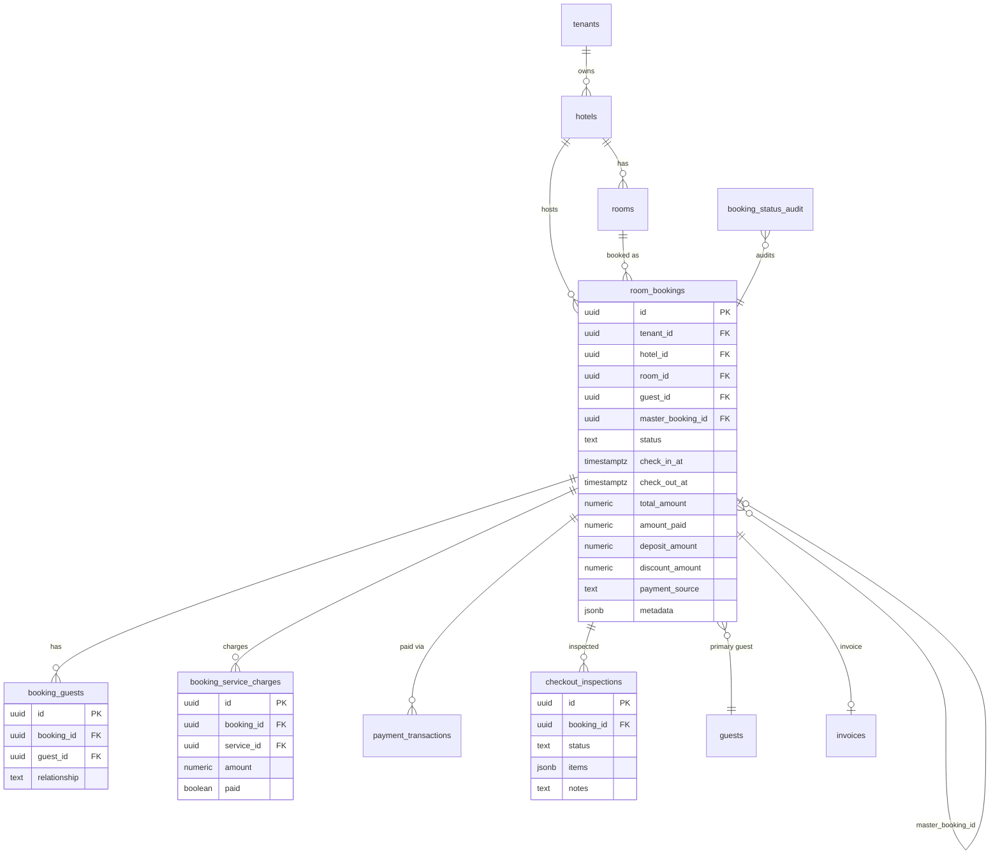

# ERD: Bookings Domain

```mermaid
erDiagram
    tenants ||--o{ hotels : owns
    hotels ||--o{ rooms : has
    hotels ||--o{ room_bookings : hosts
    rooms ||--o{ room_bookings : "booked as"
    room_bookings ||--o{ booking_guests : has
    room_bookings ||--o{ booking_service_charges : charges
    room_bookings ||--o{ payment_transactions : "paid via"
    room_bookings ||--o{ checkout_inspections : inspected
    room_bookings }o--|| guests : "primary guest"
    room_bookings }o--o| room_bookings : "master_booking_id"
    room_bookings ||--o| invoices : "invoice"
    booking_status_audit }o--|| room_bookings : audits

    room_bookings {
        uuid id PK
        uuid tenant_id FK
        uuid hotel_id FK
        uuid room_id FK
        uuid guest_id FK
        uuid master_booking_id FK
        text status
        timestamptz check_in_at
        timestamptz check_out_at
        numeric total_amount
        numeric amount_paid
        numeric deposit_amount
        numeric discount_amount
        text payment_source
        jsonb metadata
    }

    booking_guests {
        uuid id PK
        uuid booking_id FK
        uuid guest_id FK
        text relationship
    }

    booking_service_charges {
        uuid id PK
        uuid booking_id FK
        uuid service_id FK
        numeric amount
        boolean paid
    }

    checkout_inspections {
        uuid id PK
        uuid booking_id FK
        text status
        jsonb items
        text notes
    }
```

Xem `_generated/db-columns.tsv` và `_generated/db-fks.tsv` cho cột chi tiết.
