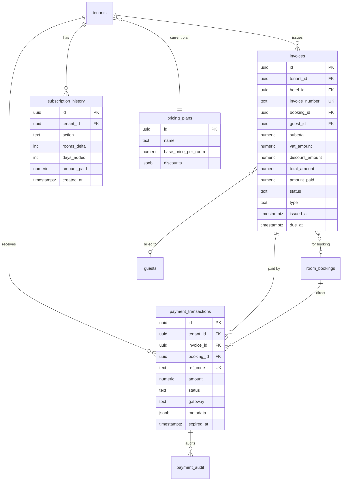

# ERD: Finance Domain

```mermaid
erDiagram
    tenants ||--o{ invoices : issues
    tenants ||--o{ payment_transactions : receives
    invoices ||--o{ payment_transactions : "paid by"
    invoices }o--o| room_bookings : "for booking"
    room_bookings ||--o{ payment_transactions : direct
    tenants ||--o{ subscription_history : has
    tenants }o--|| pricing_plans : "current plan"
    payment_transactions ||--o{ payment_audit : audits
    invoices }o--o| guests : "billed to"

    invoices {
        uuid id PK
        uuid tenant_id FK
        uuid hotel_id FK
        text invoice_number UK
        uuid booking_id FK
        uuid guest_id FK
        numeric subtotal
        numeric vat_amount
        numeric discount_amount
        numeric total_amount
        numeric amount_paid
        text status
        text type
        timestamptz issued_at
        timestamptz due_at
    }

    payment_transactions {
        uuid id PK
        uuid tenant_id FK
        uuid invoice_id FK
        uuid booking_id FK
        text ref_code UK
        numeric amount
        text status
        text gateway
        jsonb metadata
        timestamptz expired_at
    }

    pricing_plans {
        uuid id PK
        text name
        numeric base_price_per_room
        jsonb discounts
    }

    subscription_history {
        uuid id PK
        uuid tenant_id FK
        text action
        int rooms_delta
        int days_added
        numeric amount_paid
        timestamptz created_at
    }
```

Memory: `qr-payment-system-spec`, `payment-distribution-metadata`, `vietqr-settings-hierarchy`.
