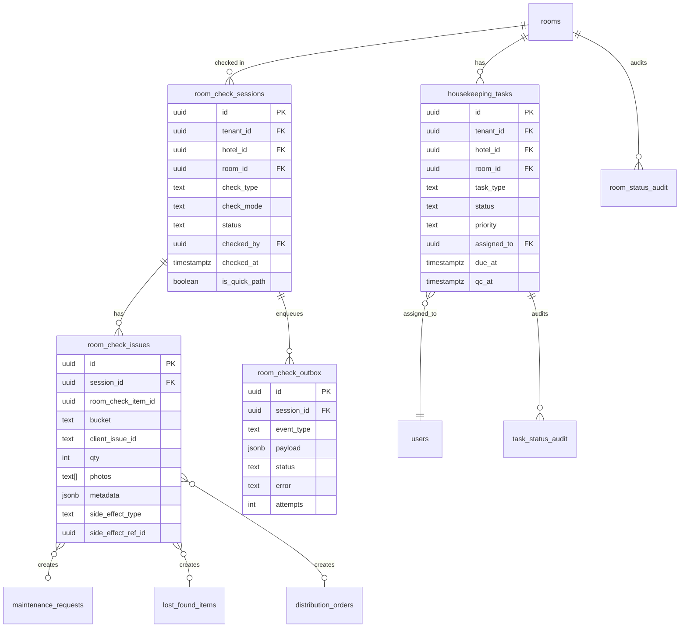

# ERD: Housekeeping Domain

```mermaid
erDiagram
    rooms ||--o{ room_check_sessions : "checked in"
    room_check_sessions ||--o{ room_check_issues : has
    room_check_sessions ||--o{ room_check_outbox : enqueues
    room_check_issues }o--o| maintenance_requests : "creates"
    room_check_issues }o--o| lost_found_items : "creates"
    room_check_issues }o--o| distribution_orders : "creates"
    rooms ||--o{ housekeeping_tasks : has
    housekeeping_tasks }o--|| users : "assigned_to"
    housekeeping_tasks ||--o{ task_status_audit : audits
    rooms ||--o{ room_status_audit : audits

    room_check_sessions {
        uuid id PK
        uuid tenant_id FK
        uuid hotel_id FK
        uuid room_id FK
        text check_type
        text check_mode
        text status
        uuid checked_by FK
        timestamptz checked_at
        boolean is_quick_path
    }

    room_check_issues {
        uuid id PK
        uuid session_id FK
        uuid room_check_item_id
        text bucket
        text client_issue_id
        int qty
        text[] photos
        jsonb metadata
        text side_effect_type
        uuid side_effect_ref_id
    }

    room_check_outbox {
        uuid id PK
        uuid session_id FK
        text event_type
        jsonb payload
        text status
        text error
        int attempts
    }

    housekeeping_tasks {
        uuid id PK
        uuid tenant_id FK
        uuid hotel_id FK
        uuid room_id FK
        text task_type
        text status
        text priority
        uuid assigned_to FK
        timestamptz due_at
        timestamptz qc_at
    }
```
