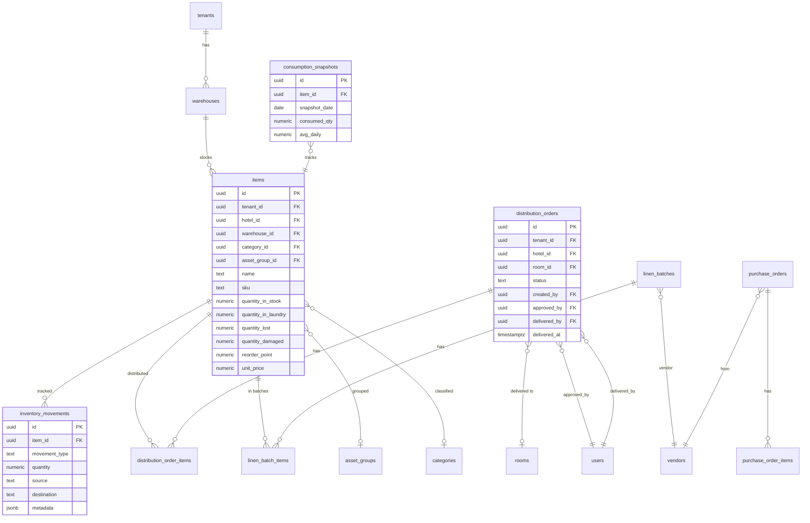

# ERD: Inventory Domain

```mermaid
erDiagram
    tenants ||--o{ warehouses : has
    warehouses ||--o{ items : stocks
    items ||--o{ inventory_movements : tracked
    items ||--o{ distribution_order_items : distributed
    distribution_orders ||--o{ distribution_order_items : has
    distribution_orders }o--o| rooms : "delivered to"
    distribution_orders }o--|| users : "approved_by"
    distribution_orders }o--|| users : "delivered_by"
    items ||--o{ linen_batch_items : "in batches"
    linen_batches ||--o{ linen_batch_items : has
    linen_batches }o--|| vendors : "vendor"
    purchase_orders ||--o{ purchase_order_items : has
    purchase_orders }o--|| vendors : from
    items }o--o| asset_groups : "grouped"
    items }o--o| categories : classified
    consumption_snapshots }o--|| items : tracks

    items {
        uuid id PK
        uuid tenant_id FK
        uuid hotel_id FK
        uuid warehouse_id FK
        uuid category_id FK
        uuid asset_group_id FK
        text name
        text sku
        numeric quantity_in_stock
        numeric quantity_in_laundry
        numeric quantity_lost
        numeric quantity_damaged
        numeric reorder_point
        numeric unit_price
    }

    distribution_orders {
        uuid id PK
        uuid tenant_id FK
        uuid hotel_id FK
        uuid room_id FK
        text status
        uuid created_by FK
        uuid approved_by FK
        uuid delivered_by FK
        timestamptz delivered_at
    }

    inventory_movements {
        uuid id PK
        uuid item_id FK
        text movement_type
        numeric quantity
        text source
        text destination
        jsonb metadata
    }

    consumption_snapshots {
        uuid id PK
        uuid item_id FK
        date snapshot_date
        numeric consumed_qty
        numeric avg_daily
    }
```

Memory: `intelligence-c2-snapshots-v1`, `asset-group-system-v1`.
