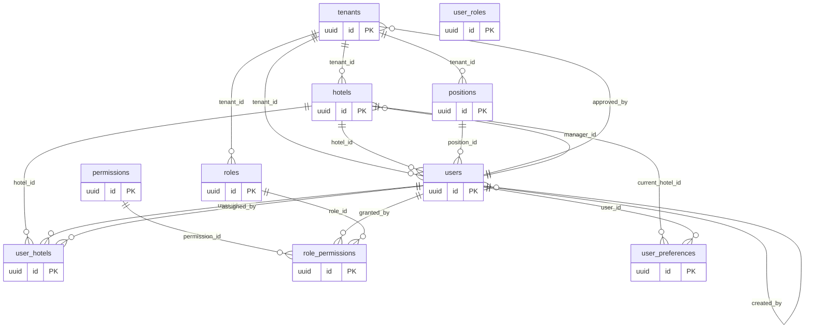
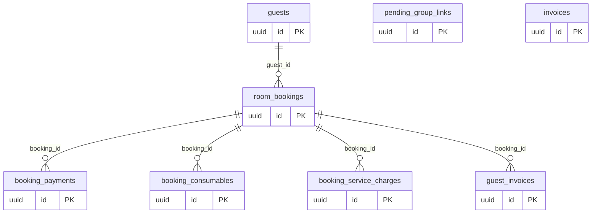
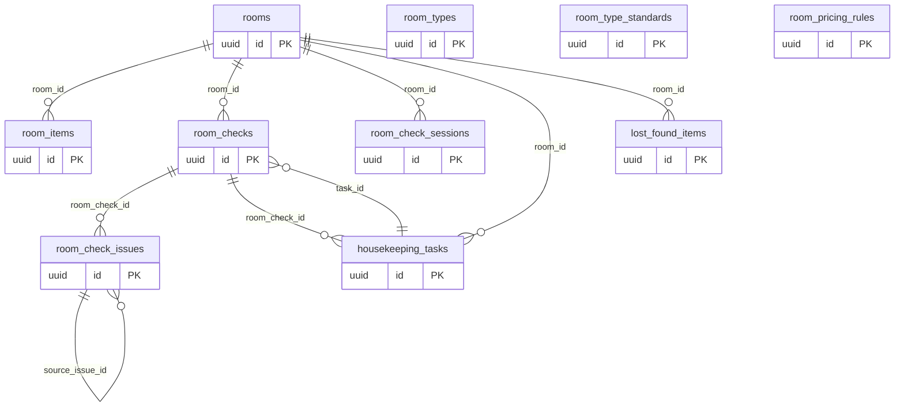
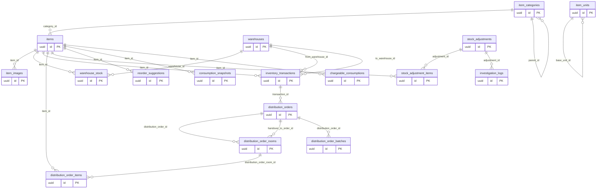
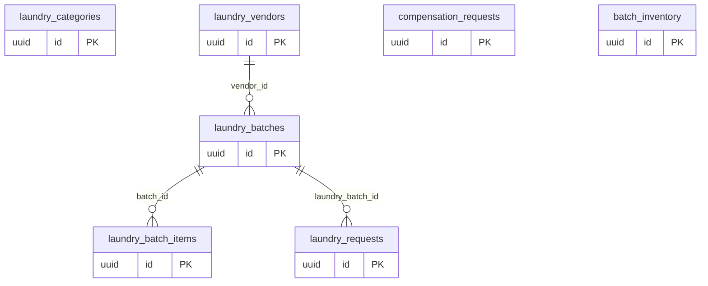
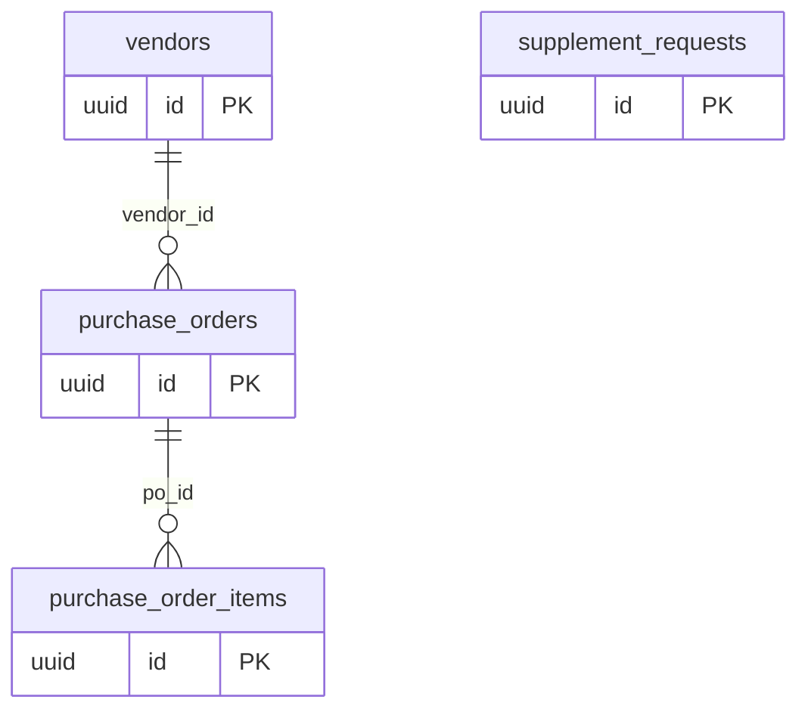
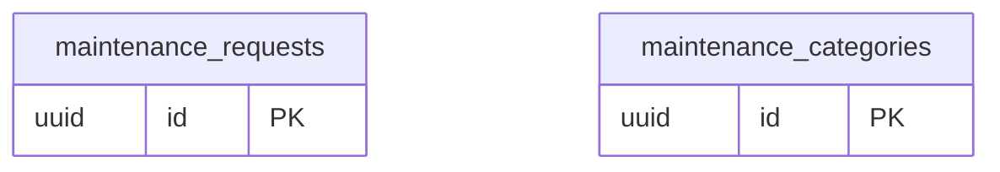
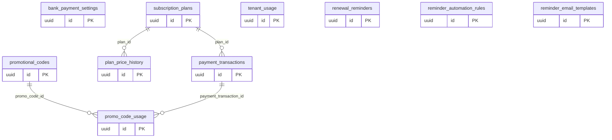
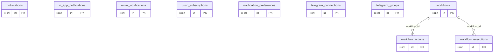
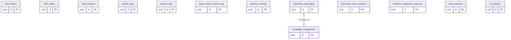

# ERD Overview

Mỗi domain có ERD riêng (xem các file `erd-*.md`). File này là bản đồ tổng + Mermaid theo domain.

**Tổng: 120 bảng, 289 foreign key.**

## Tenant & Auth

## Bookings & Guests

## Rooms & Housekeeping

## Inventory

## Laundry

## Vendors & PO

## Maintenance

## Payment & Subscription

## Notifications & Workflows

## Operations

## Bảng chưa phân nhóm (29)

- `audit_log`
- `custom_field_values`
- `custom_fields`
- `dashboard_activities`
- `dashboard_stats`
- `email_logs`
- `email_templates`
- `hotel_policy`
- `hotel_policy_history`
- `import_export_history`
- `laundry_batch_audit`
- `password_reset_otps`
- `payment_methods`
- `payment_webhook_logs`
- `pg_all_foreign_keys`
- `qc_floor_stats_30d`
- `qc_reviews`
- `qc_sla_settings`
- `qc_staff_stats_30d`
- `rate_limit_hits`
- `room_check_issue_outbox`
- `room_check_issue_reviews`
- `room_check_staff_items_view`
- `shift_reminders`
- `tap_funky`
- `user_levels`
- `user_permissions`
- `user_with_levels`
- `v_user_effective_roles`
