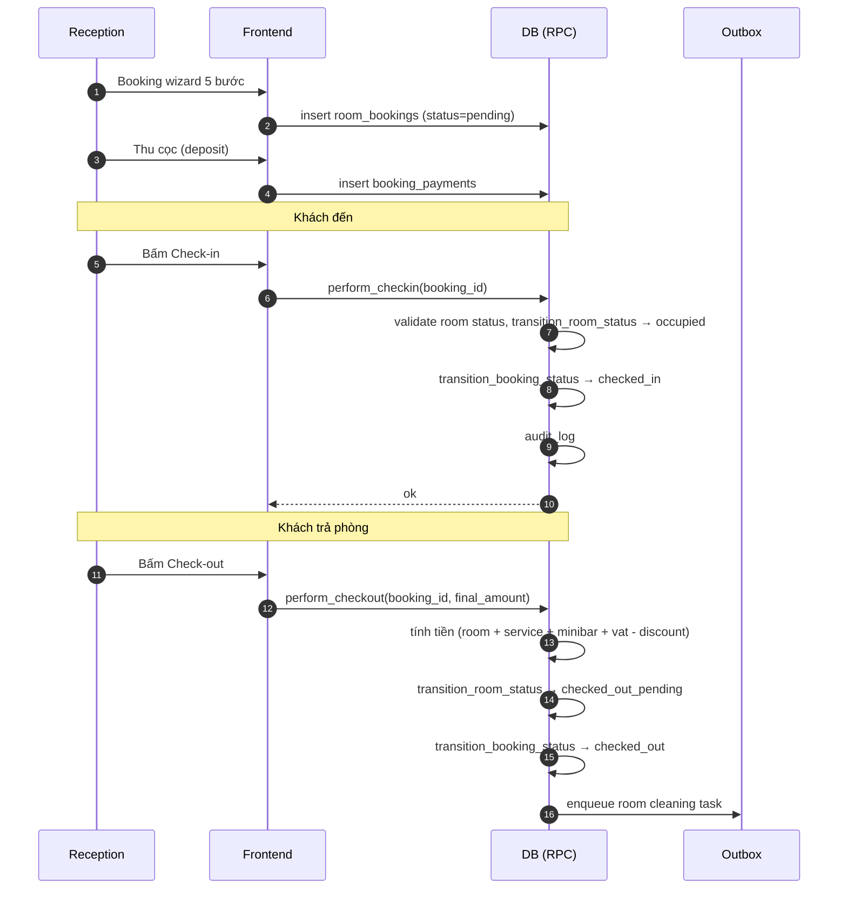
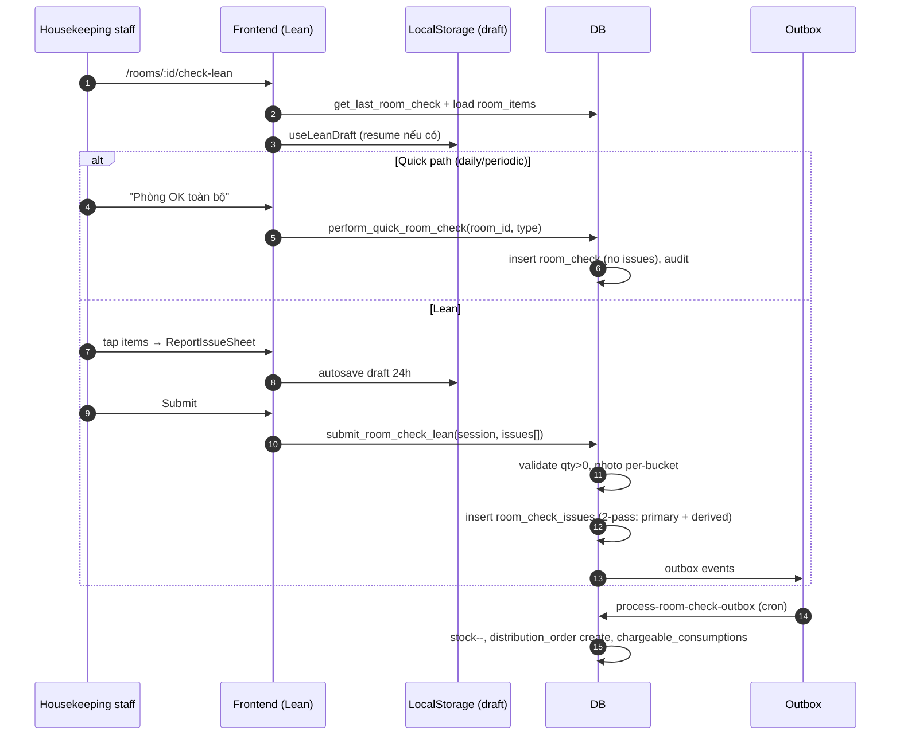
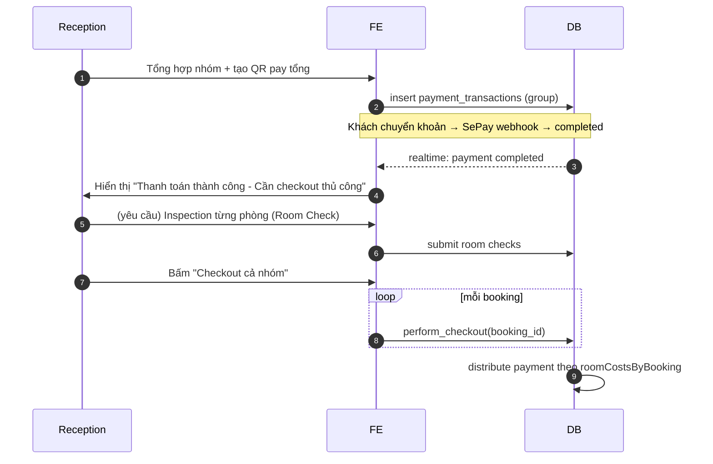
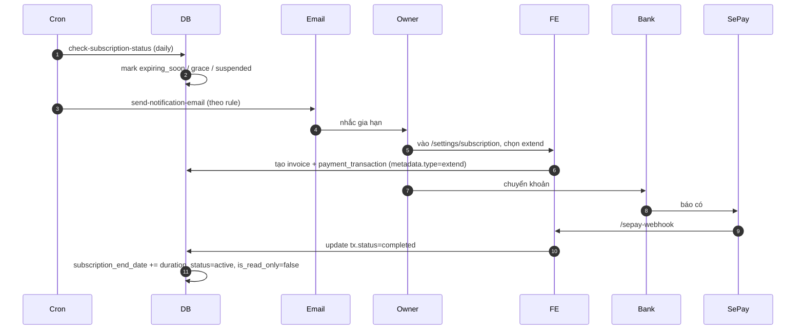
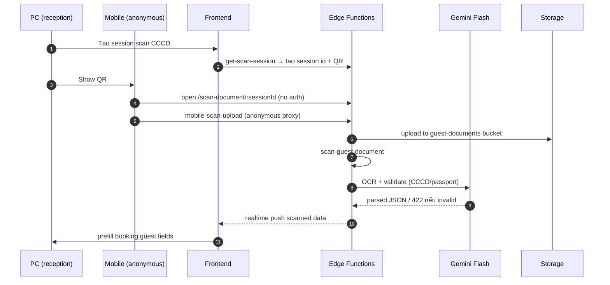

# Flows tổng hợp (sequence diagrams)

> Gom các flow chính vào 1 file để dễ đối chiếu.

## 1. Booking lifecycle (daily)

## 2. Room Check Lean

## 3. SePay payment match

(Xem `01-modules/payment.md` — đã có sequence diagram đầy đủ.)

## 4. Group checkout (manual post-payment)

## 5. Subscription renewal

## 6. Document scan (mobile capture)

