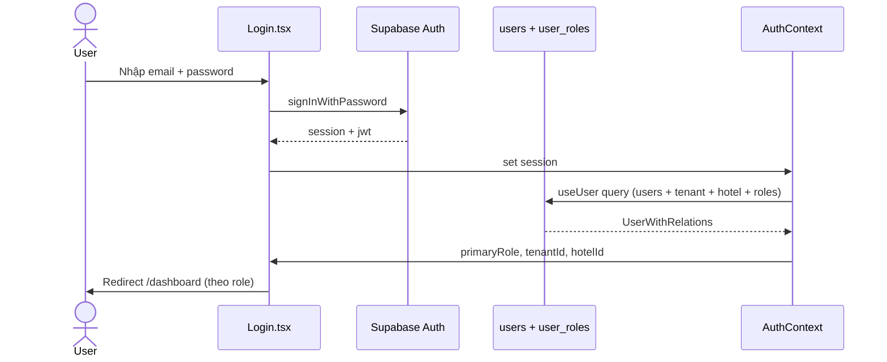
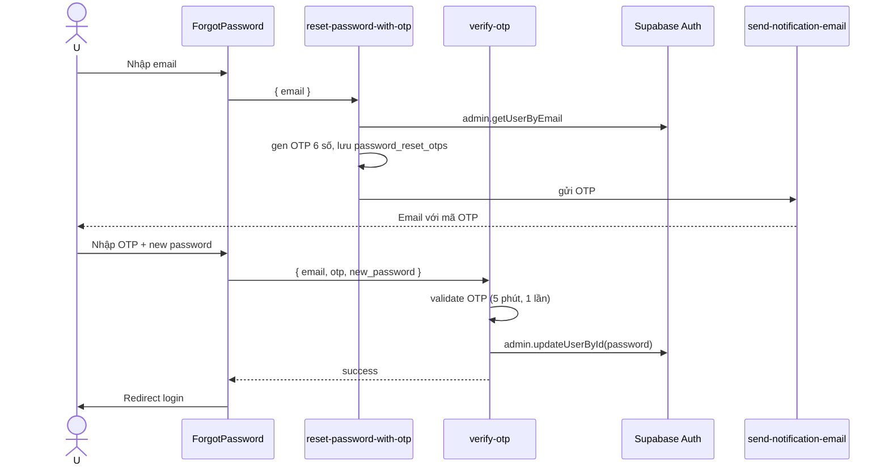

# Flow: Authentication & Onboarding

## Tổng quan
Email/password + Google OAuth. PWA cache credentials cho mobile staff. Password reset qua OTP edge function.

## Sequence: Đăng nhập email/password

## Sequence: Password reset qua OTP

Memory: `secure-otp-and-password-reset-v1`. Password validation high-strength (zod).

## PWA Credential caching
- `lib/credential-manager.ts` lưu credentials vào IndexedDB (encrypted)
- Khi mất mạng + PWA mode → fallback offline auth (read-only)
- Auto re-validate khi online lại
Memory: `pwa-credential-management-spec`.

## Onboarding flow (tenant mới)
1. Register → tạo `auth.users` (chưa có row trong `public.users`)
2. `useUser` return `null` → redirect `/onboarding`
3. User chọn: tạo tenant mới hoặc join existing (qua invite)
4. Form: tên hotel, address, plan trial
5. RPC `create_tenant_with_owner` → tạo `tenants` + `users` + `user_roles=owner` + `hotels[0]` + 14-day trial

## Permissions checkpoint
- `RoleGuard` ở route bao bọc page
- `usePermission(permission)` hook check ở component
- Server-side: RLS + RPC `has_role(uid, role)`
