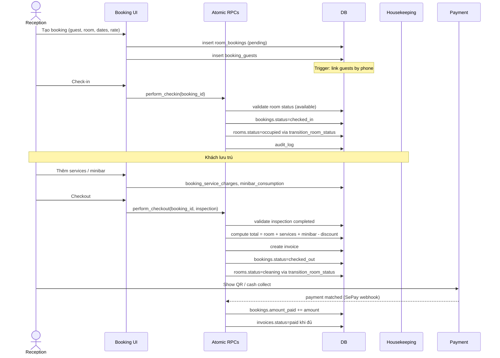

# Flow: Booking Lifecycle

## Tổng quan
Full lifecycle: tạo booking → check-in → ở → checkout → invoice → payment match.

## Sequence



## Tài chính
```
total_amount   = room_total + service_charges + minibar - discount + vat (nếu exclusive)
amount_paid    = sum(payment_transactions success)
deposit_amount = paid trước check-in
unpaid_debt    = total_amount - (amount_paid + deposit_amount)
```
Memory: `checkout-and-payment-logic`.

## Group booking
- Master booking + sub bookings (1 room/sub)
- Payment đổ vào master → distribute theo `roomCostsByBooking`
- Checkout từng phòng độc lập, NHƯNG checkout group là **manual** sau khi paid (memory `group-checkout-manual-enforcement-v1`)

## Edge cases
- Early check-in surcharge (memory `check-in-surcharge-logic`)
- Walk-in deposit convention (memory `walk-in-deposit-logic-convention`)
- OTA bookings: payment đã collect bên OTA → flag `payment_source=ota` (memory `ota-integration-spec`)

## Validation
- Không cho check-in nếu room `cleaning | maintenance | dnd | oos` (memory `occupancy-validation`)
- Không cho overlap dates trên cùng room (memory `availability-logic`)
