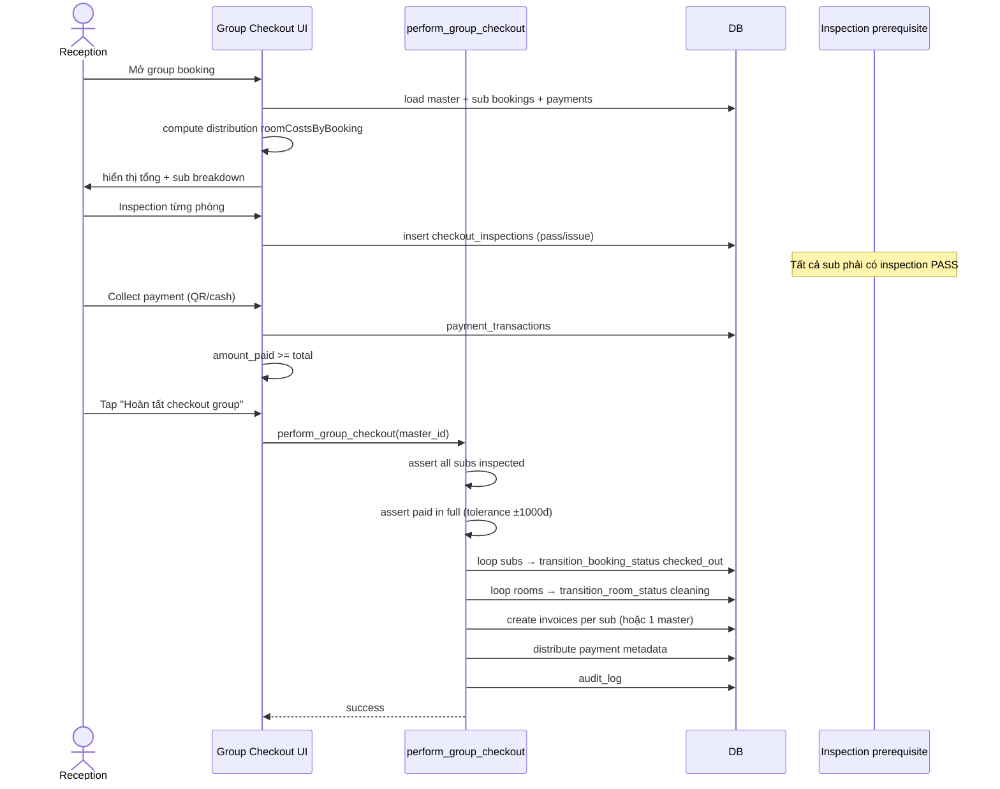

# Flow: Group Checkout

## Tổng quan
Checkout group booking sau khi payment đã đủ. **Manual enforcement** — không auto-checkout khi paid.

## Sequence



## Distribution payment
Memory `group-payment-distribution-fix-v1`:
```
roomCostsByBooking[sub_id] = sub.total / master.total * payment_amount
```
Áp dụng khi webhook match payment vào master → fan-out vào subs.

## Validation
- Mọi sub phải `checkout_inspection.status = 'pass'`
- `master.amount_paid + deposit >= master.total - tolerance`
- Không có sub đang `checked_in` mà chưa inspect

## Memory
`unified-group-checkout-spec`, `group-checkout-manual-enforcement-v1`, `group-payment-realtime-v1`.
