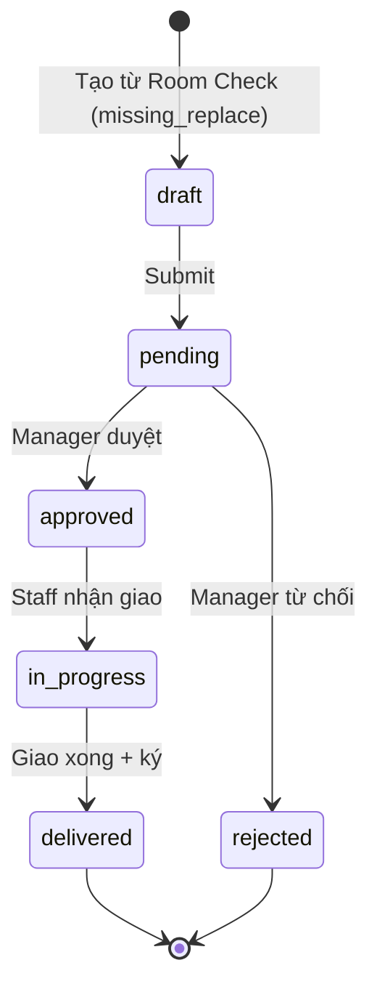
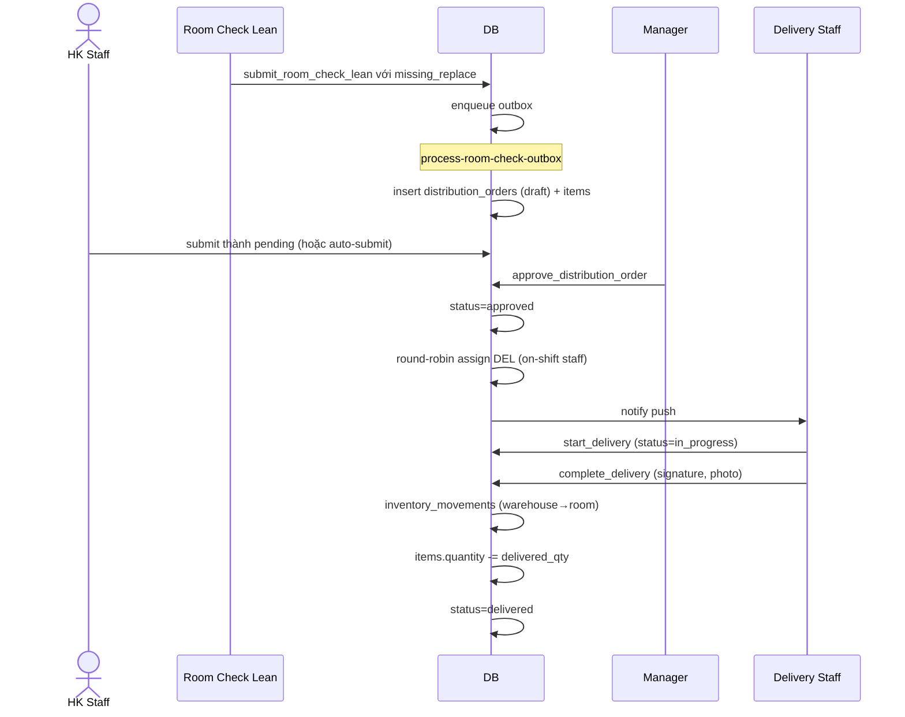

# Flow: Inventory Distribution

## Tổng quan
Distribution = chuyển hàng từ warehouse → room/department. Có flow approval (manager duyệt → staff giao). Có round-robin auto-assign. Có route batch (1 chuyến đi nhiều phòng).

## State machine

## Sequence

## Validate
- Warehouse phải tồn tại (memory `warehouse-prerequisite-constraint`)
- Stock đủ trước khi approve
- Manager approval bắt buộc (memory `stock-integrity-and-distribution`)

## Route batch
Khi nhiều order cùng floor/wing → gom thành 1 route, in phiếu giao tổng (`printDistributionOrder.ts`).

## Round-robin assignment
- Filter `staff_status` on-shift trong department phù hợp
- Track `last_assigned_at` → chọn nhỏ nhất
- Memory: `unified-operations-and-task-system`

## Stock deduction
Memory `stock-deduction-rules`:
- Atomic RPC `deduct_inventory_for_distribution`
- Chỉ trừ khi `status=delivered`, không trừ ở `approved` (tránh trừ kép nếu reject)

## Memory
`features/inventory/stock-integrity-and-distribution`, `unified-operations-and-task-system`, `excel-import-standard-v1-refined`.
