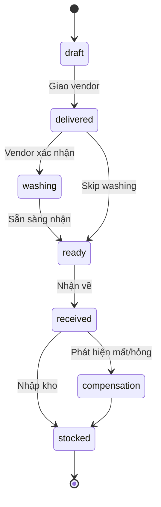
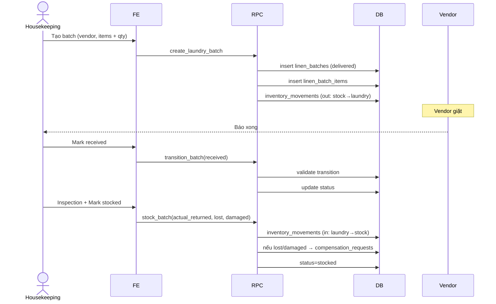

# Flow: Laundry Batch

## Tổng quan
Quản lý batch giặt: tạo → giao nhà giặt → nhận về → nhập kho. Compensation khi mất/hỏng.

## State machine



## Inventory impact

| Transition | Stock | Laundry | Lost/Damaged |
|---|---|---|---|
| `draft → delivered` | -qty | +qty | – |
| `received → stocked` | +qty | -qty | – |
| `compensation` (lost) | – | -qty | +qty (lost) |
| `compensation` (damaged) | – | -qty | +qty (damaged) |

## Sequence: Tạo + nhận batch



## Compensation
- Cron `laundry-compensation-cron` quét batch quá hạn không nhận về
- Tạo `compensation_requests` cho vendor
- Manager approve → trừ từ vendor balance

Memory: `laundry/operations-spec`, `fsm-v1-sprint1c`.

## Allowed transitions (validate trong RPC)
```
draft       → delivered
delivered   → washing | ready
washing     → ready
ready       → received
received    → stocked | compensation
compensation→ stocked
```
