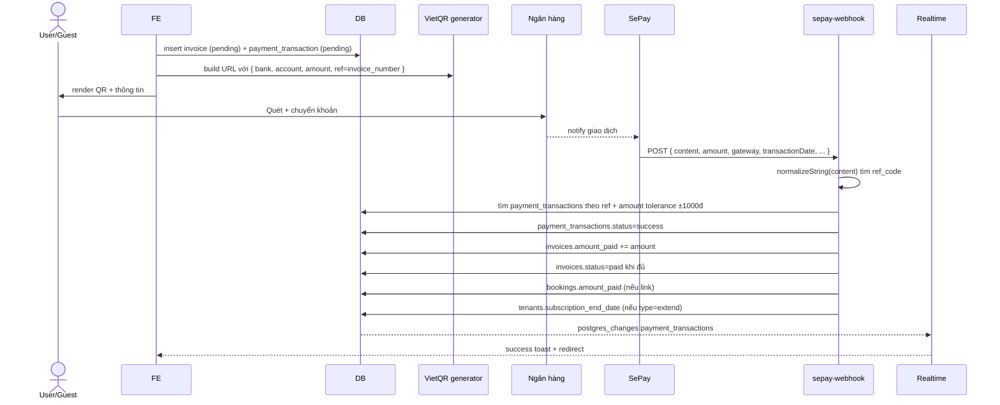

# Flow: Payment VietQR + SePay

## Tổng quan
Tạo invoice → render VietQR với `invoice_number` làm reference → SePay webhook match → update status realtime.

## Sequence

## Reference codes (canonical)
Memory `qr-payment-system-spec`:
- Booking payment: `INV-{tenant_short}-{seq}`
- Subscription extend: `SUB-{tenant_short}-{seq}`
- Custom: prefix riêng per tenant

## Match logic
1. Normalize content: bỏ dấu, viết hoa, bỏ ký tự đặc biệt
2. Regex tìm ref_code
3. Lookup `payment_transactions` WHERE `ref_code` AND `status='pending'`
4. Validate `|tx.amount - webhook.amount| <= 1000`
5. Secondary match (TBD): theo amount + thời gian + gateway nếu ref miss

## Hierarchy VietQR settings
Memory `vietqr-settings-hierarchy`:
- Hotel có `vietqr_config` → dùng hotel
- Else fallback `tenants.vietqr_config` global

## Anonymous QR access
Public route `/pay/:ref_code` không auth → guest scan QR riêng cho booking (memory `qr-payment-public-access-spec`).

## Edge function
`sepay-webhook`:
- Public, không verify_jwt
- Cần thêm: shared secret header + IP allowlist (F-SEC-02)

## Subscription extend
Memory rule: `metadata.type='extend'` (không dùng `'renewal'`). Cộng ngày vào `subscription_end_date`, cộng `additional_rooms` vào `registered_rooms`.

## Cron expire
`expire-pending-payments` chạy mỗi 5 phút → mark `status=expired` các transaction > 30 phút chưa match.
