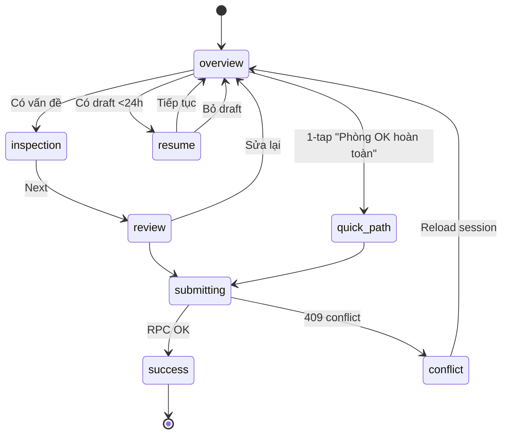
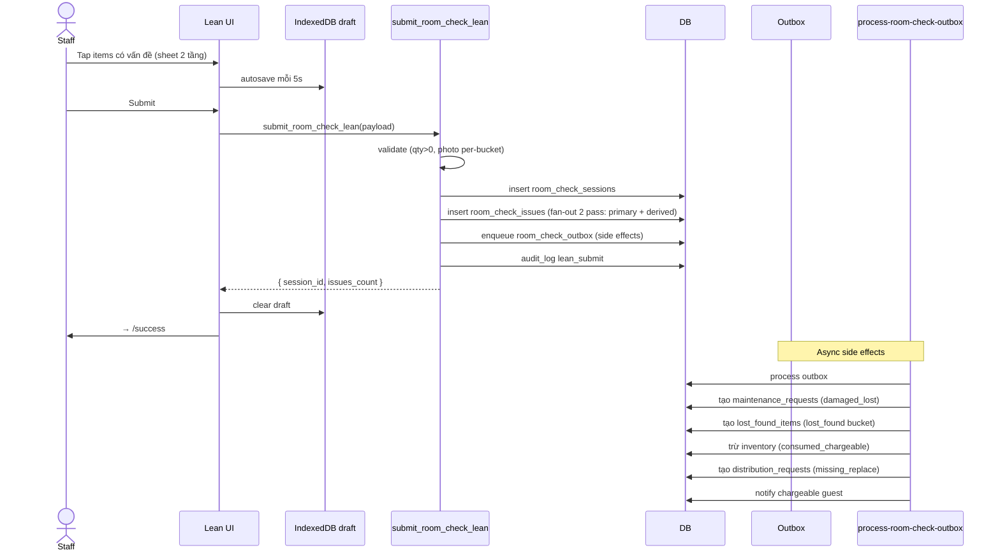

# Flow: Room Check Lean

## Tổng quan
Quy trình kiểm phòng tinh gọn: Default-OK reverse logic — mọi item mặc định OK, chỉ tap khi có vấn đề. Atomic RPC + outbox + autosave 24h.

## Routes
- `/rooms/:id/check` → `RoomCheckRouter` redirect Lean (trừ replenish/delivery)
- `/rooms/:id/check-lean` → Overview
- `/rooms/:id/check-lean/inspection` → Step 2
- `/rooms/:id/check-lean/review` → Step 3
- `/rooms/:id/check-lean/success` → Confirmation

## State machine session

## Sequence: Submit Lean

## Issue buckets (5)
| Bucket | Photo? | Side effect |
|---|---|---|
| `damaged_lost` | ON (default) | Maintenance request |
| `missing_replace` | OFF | Distribution request |
| `consumed_chargeable` | OFF | Trừ inventory + charge guest |
| `dirty` | OFF | HK task |
| `lost_found` | ON | Lost & found item |

Memory: `room-check-lean-validation-and-permission-v1`.

## Quick path
- Chỉ áp dụng `daily | periodic` (không checkin/checkout)
- RPC `perform_quick_room_check(room_id, type)` → tạo session rỗng + audit `quick_submit`
- Undo trong 5 phút: RPC `undo_quick_room_check`

## Reopen (Manager)
- RPC `reopen_room_check(session_id, reason)` → unlock session, audit
- UI: Manager menu trên session detail

## Realtime
Subscribe `room_check_sessions` filter `room_id=eq.X` → sync check type + lock state cho multi-staff.

Memories: `room-check-lean-business-logic-v1`, `lean-ui-step1/2/3`, `lean-undo-and-edit-v1`, `lean-rollout-router-v1`, `lean-rollout-completion-v1`.
