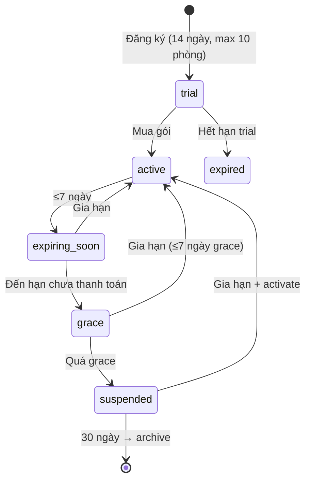
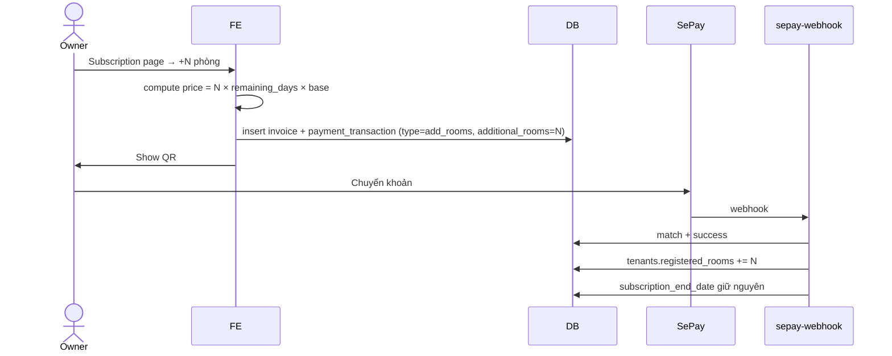
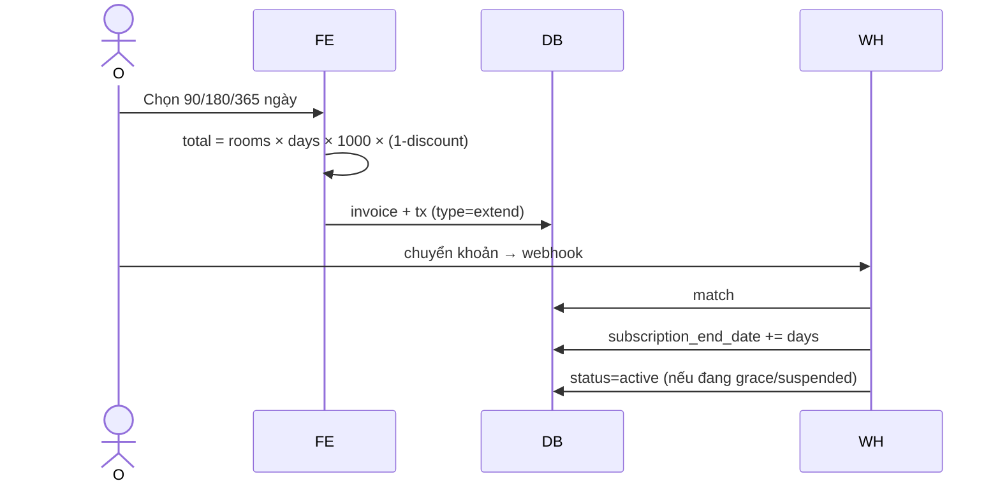

# Flow: Subscription Renewal

## Tổng quan
Room-based pricing 1.000đ/phòng/ngày, tối thiểu 30 ngày. Discount theo thời hạn. Grace period + suspended state.

## Pricing
```
base_price       = 1000 VND/room/day
min_days         = 30
discount         = { 90d: 5%, 180d: 10%, 365d: 15% }
total            = registered_rooms × days × base_price × (1 - discount)
```

## State



Memory: `room-limits-and-payment-enforcement`, `renewal-warning-system-v1`, `suspended-access-restriction-v1`.

## Sequence: Mua thêm phòng



## Sequence: Gia hạn



## Cron checks
- `check-subscription-status` daily → cập nhật `subscription_status`, gửi reminder
- Suspended sau 7 ngày grace → block access (route guard + RLS)

## Renewal reminders (Super Admin)
- Cron daily quét `subscription_end_date` ≤ 14 ngày
- Tạo `renewal_reminders` + email
- Track engagement

Memory: `reminder-automation-architecture-v1`.
