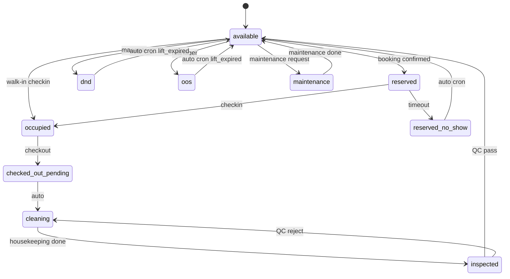
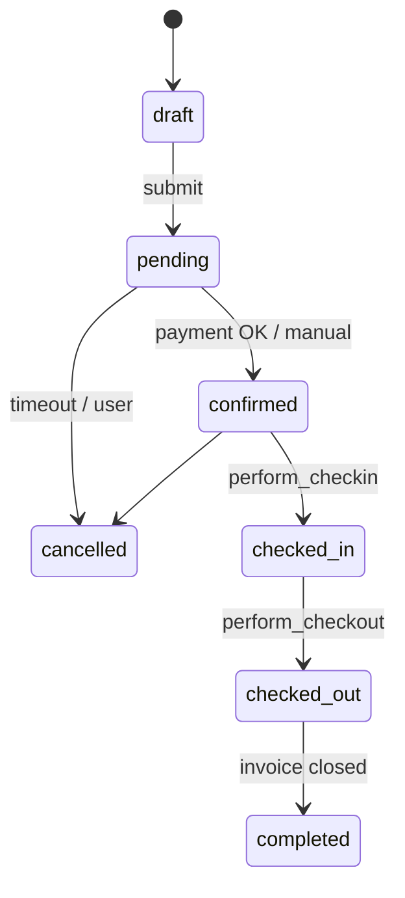
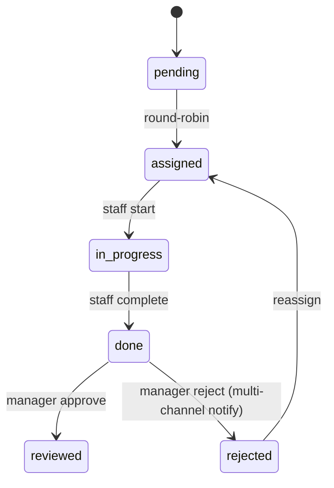
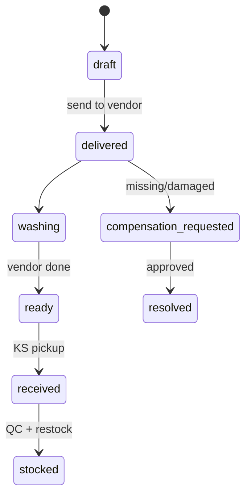
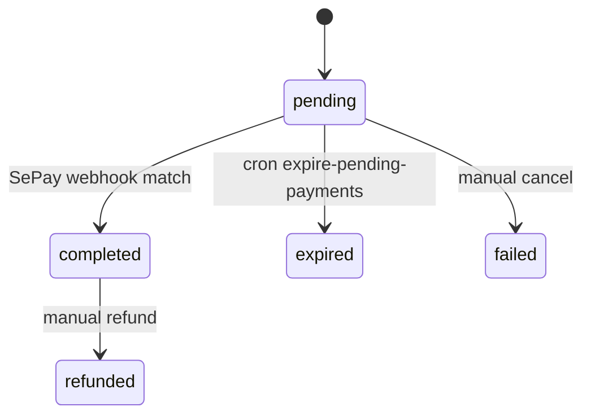
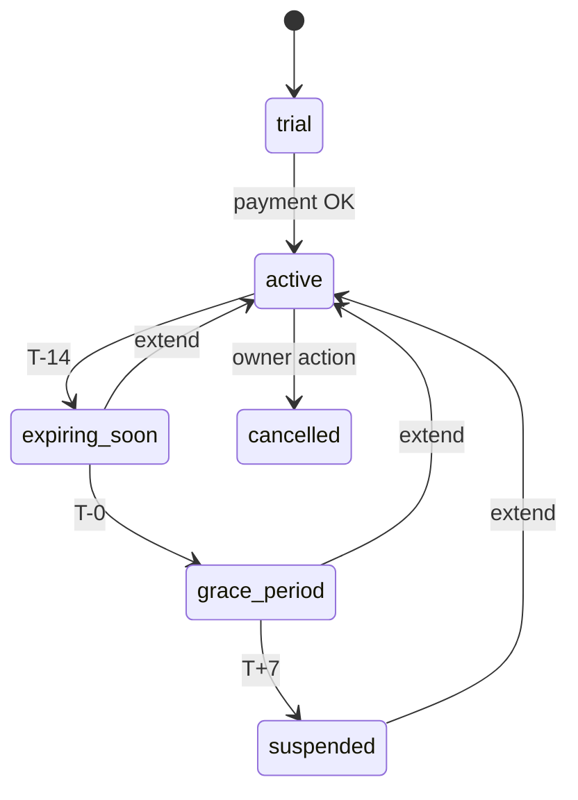
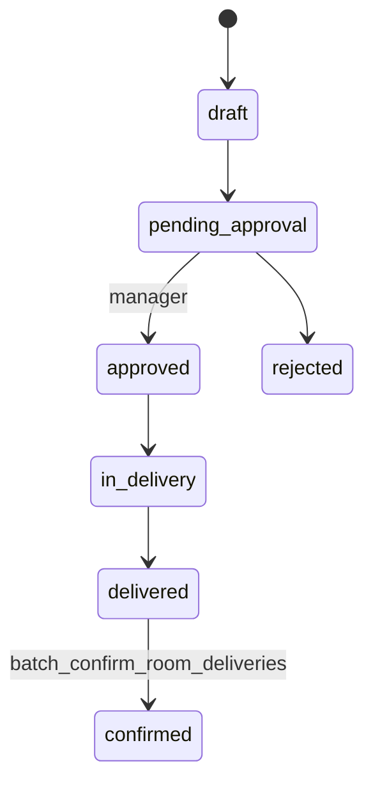

# State Machines

Tóm tắt 5 FSM chính. Mọi transition đi qua RPC có audit log + permission check.

## 1. Room Status (11 trạng thái — v2)

RPC: `transition_room_status(p_room_id, p_new_status, p_reason)`. Cron: `lift-expired-dnd-oos`.

## 2. Booking Status

RPC: `transition_booking_status`, `perform_checkin`, `perform_checkout`, `cancel_booking`.

## 3. Task QC

RPC: `transition_task_status`, `approve_task`.

## 4. Laundry Batch

## 5. Payment Transaction

## 6. Subscription

Flag `is_read_only=true` khi suspended → block mutations.

## 7. Distribution Order

