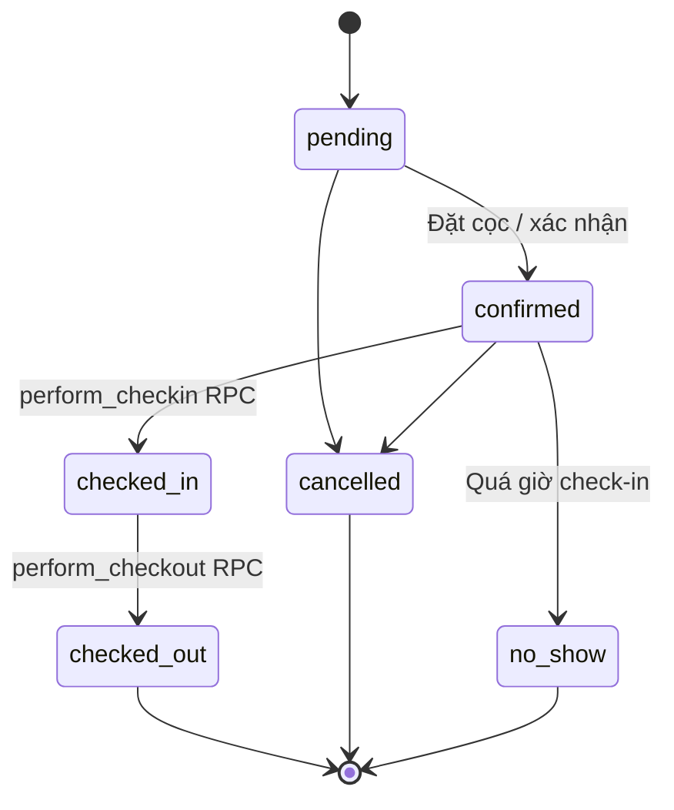

# State Machine: Booking Status

## Trạng thái
- `pending` — tạo nhưng chưa confirm
- `confirmed` — đã confirm/đặt cọc
- `checked_in` — đã nhận phòng
- `checked_out` — đã trả phòng
- `cancelled` — hủy
- `no_show` — không đến

## Diagram

## RPC: `transition_booking_status`
- Validate transition + booking constraints
- Insert `booking_status_audit`
- Trigger side effects (release room, refund deposit…)

## Constraint
- Không thể transition trực tiếp `checked_in → cancelled` → phải qua checkout với refund flag
- `no_show` chỉ set qua cron, không manual
