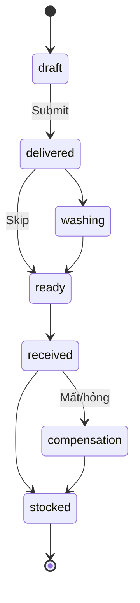

# State Machine: Laundry Batch

Xem `03-flows/laundry-batch.md` cho sequence chi tiết.

## Trạng thái
- `draft` — đang soạn
- `delivered` — đã giao vendor
- `washing` — vendor đang giặt
- `ready` — sẵn sàng nhận về
- `received` — đã nhận về (chưa nhập kho)
- `stocked` — đã nhập kho
- `compensation` — đang xử lý đền bù

## Diagram



## Allowed transitions (validate RPC)
```
draft        → delivered
delivered    → washing | ready
washing      → ready
ready        → received
received     → stocked | compensation
compensation → stocked
```

Memory: `laundry/operations-spec`, `fsm-v1-sprint1c`.
