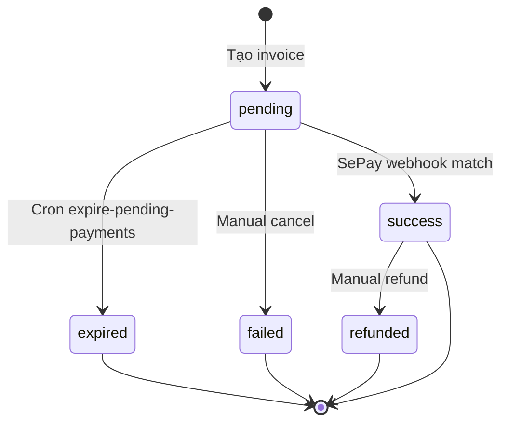

# State Machine: Payment Transaction

## Trạng thái
- `pending` — chờ khách chuyển
- `success` — đã nhận tiền
- `failed` — match fail / hủy
- `expired` — quá hạn (>30 phút mặc định)
- `refunded` — đã hoàn (manual)

## Diagram

## Match logic
1. Webhook → `normalizeString(content)` tìm `ref_code`
2. Lookup `payment_transactions WHERE ref_code AND status='pending'`
3. Validate `|tx.amount - webhook.amount| <= payment_tolerance_vnd` (default 1000)
4. Mark success → side effects (invoice paid, booking paid, subscription extend, rooms added)

## Side effects khi success
| metadata.type | Action |
|---|---|
| `booking` | `bookings.amount_paid += amount` |
| `extend` | `tenants.subscription_end_date += days` |
| `add_rooms` | `tenants.registered_rooms += additional_rooms` |
| `service_charge` | `booking_service_charges.paid=true` |

## Cron
- `expire-pending-payments` mỗi 5 phút

## Memory
`payment-distribution-metadata`, `qr-payment-system-spec`, `group-payment-distribution-fix-v1`.
