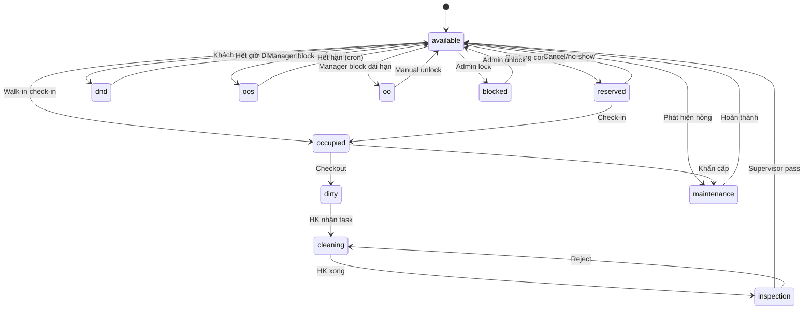

# State Machine: Room Status v2

## 11 trạng thái
| Code | Vietnamese | Mô tả |
|---|---|---|
| `available` | Trống sẵn sàng | Sẵn cho check-in |
| `occupied` | Đang ở | Có khách lưu trú |
| `cleaning` | Đang dọn | HK đang làm |
| `dirty` | Chưa dọn | Sau checkout chờ HK |
| `inspection` | Chờ kiểm tra | HK xong, chờ supervisor |
| `maintenance` | Bảo trì | Đang sửa |
| `dnd` | Không làm phiền | Khách yêu cầu, auto lift sau X giờ |
| `oos` | Ngừng kinh doanh | Out of service, có expiry |
| `oo` | Ngoài lịch | Out of order, dài hạn |
| `reserved` | Đã đặt giữ | Booking confirmed chưa check-in |
| `blocked` | Khoá | Manual lock (admin) |

## Diagram



## RPC: `transition_room_status`
```sql
transition_room_status(
  room_id uuid,
  new_status text,
  reason text default null,
  metadata jsonb default '{}'
) returns void
```
Validate:
- `from_status → new_status` có trong allowed transitions table
- User có permission tương ứng
- Insert `room_status_audit` (ai, khi nào, từ→đến, lý do)

## Cron lift
- `lift-expired-dnd-oos` chạy mỗi 15 phút → lift `dnd` (>24h default), `oos` (theo expiry)

## Memory
`state-machine-v2-rollout`, `foundation-hardening-phase-1`.
