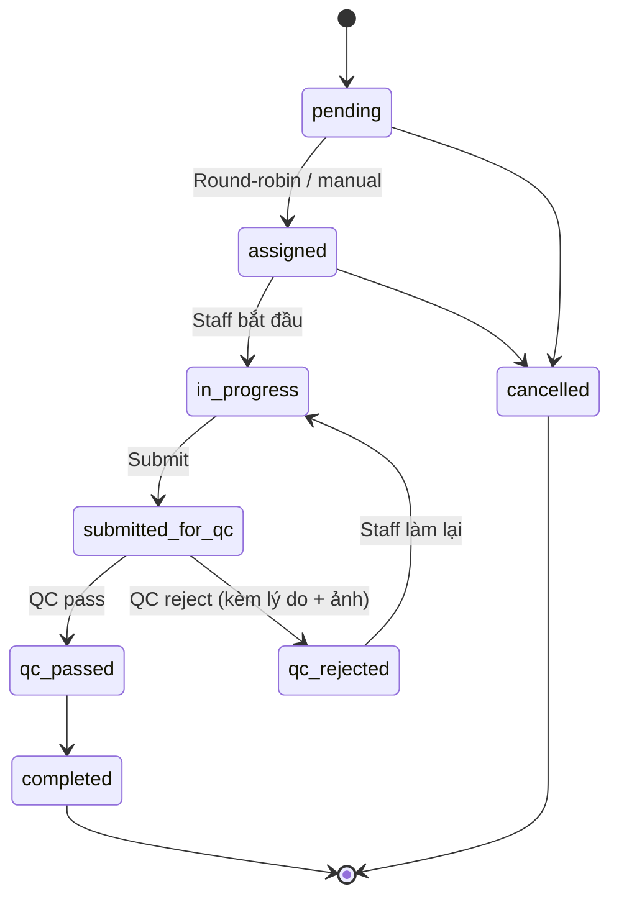

# State Machine: Task & QC Lifecycle

## Task statuses
- `pending` — chờ assign
- `assigned` — đã giao
- `in_progress` — đang làm
- `submitted_for_qc` — staff submit chờ QC
- `qc_passed` — QC duyệt
- `qc_rejected` — QC từ chối, quay lại staff
- `completed` — hoàn tất (= qc_passed final)
- `cancelled` — hủy

## Diagram

## RPC: `transition_task_status`
- Validate transition matrix
- QC reject phải có `reason` + ≥1 photo
- Notify multi-channel khi reject (in-app + push + telegram)

## QC Dashboard
- `/housekeeping/qc` — chart trend pass/reject + drill-down + Export CSV
- Memory `qc-dashboard-and-notifications-v1`

## Memory
`state-machine/v2-phase2-tasks-bookings`, `qc-dashboard-and-notifications-v1`.
