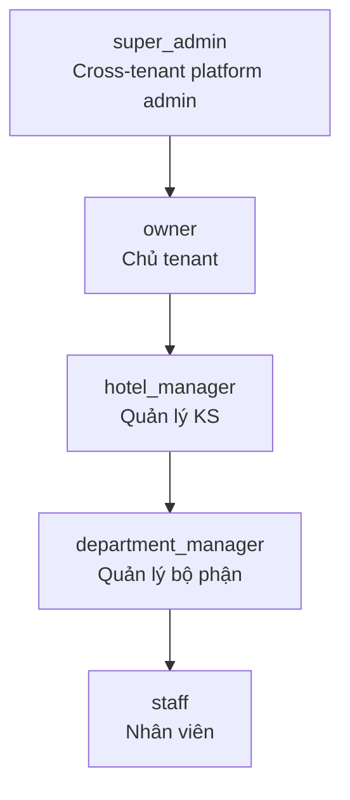

# Role Hierarchy

## 4-tier model

## App roles bảng `user_roles`
| Role | Scope | Tạo được |
|---|---|---|
| `super_admin` | Cross-tenant | All |
| `owner` | Tenant | manager, staff |
| `hotel_manager` | Hotel | manager (cùng level), staff |
| `department_manager` | Department | staff |
| `staff` | Cá nhân | – |

## User levels (legacy alias `users.user_level_code`)
- `super_admin`, `tenant_owner`, `manager`, `staff` → map sang app roles

## Hierarchy enforcement
Memory `tiered-hierarchy-and-enforcement-model`:
- Manager không thể reset password cho Owner
- Staff không thể tạo user
- Cross-hotel: Manager chỉ thấy hotels được gán via `user_hotels`

## Function `has_role(uid, role)`
Security definer, dùng trong RLS policies để tránh recursion (xem `02-data/rls-policies.md`).

## Permission resolution
1. Lookup `user_roles` for primary role (theo priority: super_admin > owner > ...)
2. Lookup `position.permissions[]` cho granular permissions
3. Merge với role defaults trong `lib/permissions.ts`

## Owner unrestricted
Memory `owner-unrestricted-navigation-v1`: Owner thấy mọi module, không filter permission UI.
