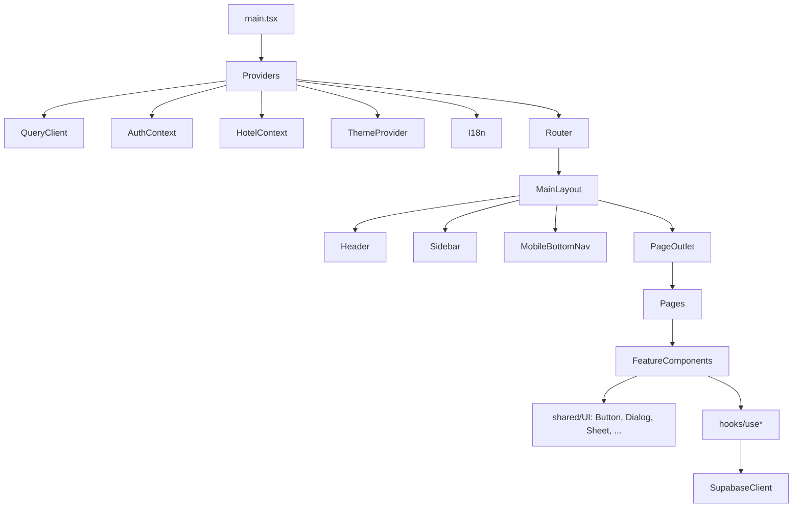

# Component Tree

## High-level

## Thư mục `src/components/`
| Subfolder | Mục đích |
|---|---|
| `ui/` | shadcn primitives (Button, Dialog, Sheet…) |
| `layout/` | Header, Sidebar, MainLayout, MobileBottomNav |
| `auth/` | Login form, RoleGuard, PermissionGuard |
| `bookings/` | Booking forms, list, checkout, group |
| `rooms/` | Room cards, status, check (Lean) |
| `housekeeping/` | Tasks, QC dashboard, ReportIssueSheet |
| `inventory/` | Items, distribution, warehouse |
| `laundry/` | Batches, vendor, compensation |
| `maintenance/` | Requests, recurring |
| `payment/` | QR display, transactions list |
| `subscription/` | Plans, renewal, usage |
| `super-admin/` | Tenants, settings, analytics |
| `notifications/` | Bell, list, preferences |
| `mobile/` | Mobile-specific (BottomSheet, SwipeableCard) |
| `shared/` | Cross-feature: EmptyState, LoadingSpinner, DataTable |

## Patterns
- **Container vs Presentational**: hooks fetch data, components receive props
- **Bottom sheets** thay Dialog ở mobile (`Sheet` từ shadcn với side="bottom")
- **Form**: react-hook-form + zod, render mọi field cùng page (constraint memory)
- **DataTable**: TanStack Table wrapped, có filter/sort/paginate
- **SwipeableCard**: shared mobile component cho swipe action

Memory: `touch-and-swipe-standards-v1`.
