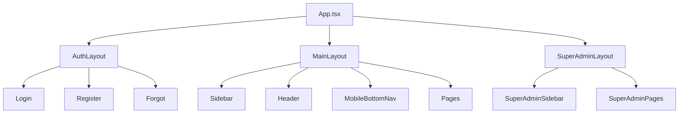

# Frontend Routing

## Tổng quan
React Router v6, route declaration ở `src/App.tsx`. Layout: `MainLayout` (desktop sidebar + mobile bottom nav), `SuperAdminLayout` (super admin), `AuthLayout` (auth pages).

## Layout hierarchy

## Route categories
| Prefix | Layout | Guard |
|---|---|---|
| `/auth/*`, `/login`, `/register` | AuthLayout | Public |
| `/onboarding` | None | Authenticated, no tenant |
| `/dashboard`, `/rooms/*`, ... | MainLayout | RoleGuard |
| `/super-admin/*`, `/admin/*` | SuperAdminLayout | super_admin |
| `/pay/:ref` | None (public) | Anonymous |
| `/scan/document` | None | Anonymous (token) |

Tổng: **140 routes** (xem `_generated/routes.json`).

## Guards
- `RoleGuard role={...}` — kiểm app_role
- `PermissionGuard permission={...}` — kiểm granular permission
- `SubscriptionGuard` — block khi suspended
- `TenantGuard` — redirect onboarding nếu chưa có tenant

## Mobile bottom nav
Memory `mobile-bottom-nav-and-back-behavior-v1`:
- Tối đa 5 items, filter theo permission
- Item dư tràn vào "More"
- Back button auto-hide ở root paths
- Smart fallback về module root khi không có history

## RoomCheckRouter pattern
`/rooms/:id/check` → `RoomCheckRouter` wrapper:
- Default redirect Lean (`/rooms/:id/check-lean`)
- Override khi `?type=replenish|delivery` hoặc query params có `distribution_order_id|room_order_id|inspection`
- Per-hotel flag `settings.room_check.use_lean` (default true)

Memory: `room-check-lean-rollout-router-v1`.

## Code splitting
Mỗi page lazy import. `Suspense` boundary ở MainLayout với spinner.
